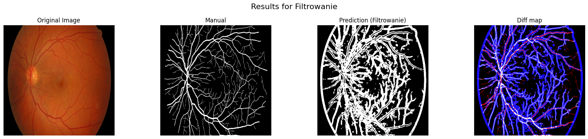
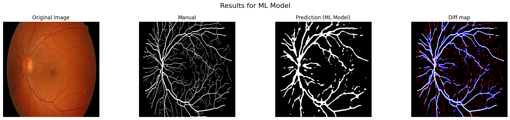
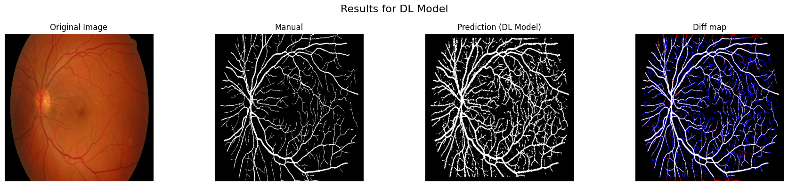
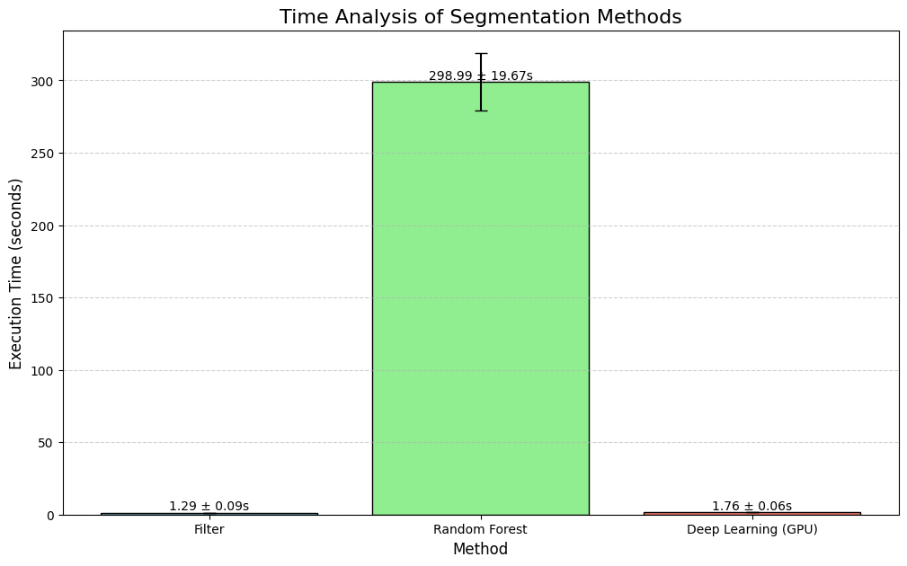

# Raport z projektu: Segmentacja naczyń dna oka

Ten raport prezentuje architekturę projektu oraz opisuje trzy podejścia do segmentacji naczyń: filtrowanie, Random Forest oraz głęboką sieć Unet. Na końcu znajduje się analiza porównawcza oraz wyniki.

## Architektura projektu

Projekt składa się z modułów służących do segmentacji naczyń dna oka. Zaimplementowano trzy podejścia:
- **Filtrowanie (Filter)**
- **Segmentacja Random Forest**
- **Segmentacja głęboką siecią Unet (DLUnet)**

Moduły uczenia maszynowego są podzielone na podmoduły odpowiadające ich semantyce:
- `model.py` – implementacja modelu,
- `train.py` – procedury uczenia i zapisu modelu,
- `inference.py` – procedury inferencji,
- `dataset.py` – przetwarzanie danych.

Współdzielona logika znajduje się w modułach `Util` oraz `Data`. Plik `config.yaml` jest centralnym miejscem konfiguracji projektu.

## Dataset

Zbiór danych to 42 obrazy dna oka. Każda próbka składa się z:
- obrazu RGB,
- maski (piksele oka vs. tło),
- etykiety (ręczna segmentacja naczyń).

Obrazy są skalowane do 512x512 pikseli dla wydajności.

## 1. Filtrowanie (Filter)

Najprostsza i najszybsza metoda, stanowiąca baseline. Wykorzystuje klasyczne przetwarzanie obrazu:
- konwersja do skali szarości,
- CLAHE (wyrównywanie histogramu),
- filtr medianowy,
- normalizacja,
- filtr Frangi (wyodrębnianie naczyń),
- operacje morfologiczne (otwarcie, domknięcie).

**Przykładowy kod:**
```python
from filter.filter_segmentation import FilterSegmentation

# image = ... # załaduj obraz
# mask = FilterSegmentation.run(image)
# plt.imshow(mask, cmap='gray')
```

**Wynik filtrowania:**


## 2. Segmentacja Random Forest

Segmentacja oparta na klasyfikatorze Random Forest, działająca na poziomie pojedynczych pikseli z wykorzystaniem otoczenia (patchy).

### Feature engineering
- Wycinane są patche o rozmiarze `n x n` (konfigurowalne).
- Z każdego patcha wyliczane są cechy:
    - wariancja kolorów,
    - momenty centralne,
    - momenty Hu,
    - cechy tekstury (GLCM: kontrast, homogeniczność, energia),
    - cechy gradientowe (histogramy orientacji, średnia, std. gradientu),
    - statystyki sąsiedztwa (średnia, std).

**Przykład:**
```python
from data.PatchFeatureExtractor import PatchFeatureExtractor

# patch = ... # wycinek obrazu
# extractor = PatchFeatureExtractor()
# features = extractor.extract_features(patch)
```

### Preprocessing
- Ekstrakcja kanału zielonego,
- CLAHE,
- filtr medianowy.

### Proces uczenia
- Patche są samplowane z każdego obrazu, z zachowaniem balansu klas.
- Patch uznawany za poprawny, jeśli ≥20% pikseli należy do maski.
- Hiperparametry Random Forest dobierane automatycznie (`hypopt.py`).

**Wynik Random Forest:**


## 3. Segmentacja głęboką siecią Unet (DLUnet)

Wykorzystuje architekturę Unet – sieć konwolucyjną typu encoder-decoder:
- **Encoder**: ekstrakcja cech na coraz niższych rozdzielczościach,
- **Decoder**: rekonstrukcja maski segmentacji z wykorzystaniem skip connections.

### Techniki zastosowane
- Dropout (zapobiega przeuczeniu),
- Standardowy preprocessing (jak w RandomForest),
- Augmentacja danych,
- Wczesne zatrzymanie (early stopping),
- Focal loss (lepsza detekcja rzadkich klas).

**Wynik Unet:**


## Porównanie czasów wykonania



## Analiza porównawcza i wnioski

### Wyniki dla poszczególnych obrazów

#### Obraz 02_dr
| Method         | Accuracy | Precision | F1     | Specificity | Sensitivity |
|----------------|----------|-----------|--------|-------------|-------------|
| Filter         | 0.7486   | 0.1593    | 0.2461 | 0.7656      | 0.5410      |
| Random Forest  | 0.8814   | 0.3589    | 0.4784 | 0.8949      | 0.7170      |
| Deep Learning  | 0.9617   | 0.7331    | 0.7556 | 0.9767      | 0.7796      |

#### Obraz 04_dr
| Method         | Accuracy | Precision | F1     | Specificity | Sensitivity |
|----------------|----------|-----------|--------|-------------|-------------|
| Filter         | 0.5748   | 0.0968    | 0.1684 | 0.5698      | 0.6456      |
| Random Forest  | 0.8768   | 0.3138    | 0.4361 | 0.8884      | 0.7147      |
| Deep Learning  | 0.9705   | 0.7633    | 0.7852 | 0.9821      | 0.8084      |

#### Obraz 04_g
| Method         | Accuracy | Precision | F1     | Specificity | Sensitivity |
|----------------|----------|-----------|--------|-------------|-------------|
| Filter         | 0.7127   | 0.1452    | 0.2310 | 0.7249      | 0.5658      |
| Random Forest  | 0.9260   | 0.5149    | 0.5209 | 0.9590      | 0.5271      |
| Deep Learning  | 0.9672   | 0.8000    | 0.7797 | 0.9843      | 0.7604      |

#### Obraz 07_dr
| Method         | Accuracy | Precision | F1     | Specificity | Sensitivity |
|----------------|----------|-----------|--------|-------------|-------------|
| Filter         | 0.6013   | 0.1369    | 0.2249 | 0.5984      | 0.6300      |
| Random Forest  | 0.8798   | 0.4131    | 0.5287 | 0.8945      | 0.7344      |
| Deep Learning  | 0.9594   | 0.7515    | 0.7907 | 0.9721      | 0.8342      |

#### Obraz 09_h
| Method         | Accuracy | Precision | F1     | Specificity | Sensitivity |
|----------------|----------|-----------|--------|-------------|-------------|
| Filter         | 0.7118   | 0.1855    | 0.2864 | 0.7204      | 0.6276      |
| Random Forest  | 0.9081   | 0.5010    | 0.5473 | 0.9390      | 0.6031      |
| Deep Learning  | 0.9697   | 0.9206    | 0.8172 | 0.9936      | 0.7347      |

#### Obraz 14_g
| Method         | Accuracy | Precision | F1     | Specificity | Sensitivity |
|----------------|----------|-----------|--------|-------------|-------------|
| Filter         | 0.6588   | 0.1449    | 0.2356 | 0.6615      | 0.6289      |
| Random Forest  | 0.8756   | 0.3644    | 0.4684 | 0.8956      | 0.6558      |
| Deep Learning  | 0.9610   | 0.7703    | 0.7654 | 0.9793      | 0.7605      |

### Średnie wyniki dla wszystkich obrazów testowych

| Method         | Accuracy | Precision | F1     | Specificity | Sensitivity |
|----------------|----------|-----------|--------|-------------|-------------|
| Deep Learning  | 0.9649   | 0.7898    | 0.7823 | 0.9813      | 0.7796      |
| Random Forest  | 0.8913   | 0.4110    | 0.4967 | 0.9119      | 0.6587      |
| Filter         | 0.6680   | 0.1448    | 0.2321 | 0.6734      | 0.6065      |

---

Wyniki pokazują, że podejście oparte na głębokim uczeniu (Unet) znacząco przewyższa klasyczne metody, zarówno pod względem dokładności, jak i miar precyzji oraz F1. Random Forest stanowi kompromis pomiędzy prostotą a skutecznością, natomiast filtrowanie jest szybkie, ale najmniej dokładne.
